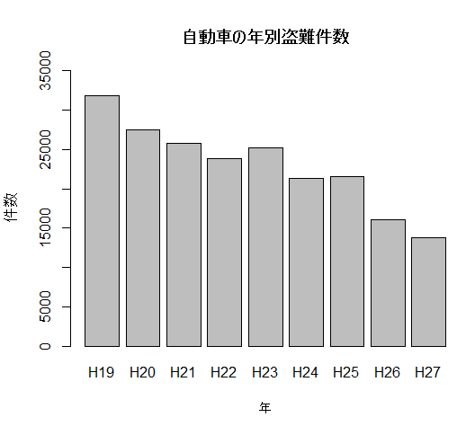

# 作成時のメモ
csvファイルから作成したい  
git hub上にアップロードしたcsvファイルを読み込むためにrowで確認したURLでは直接取得することが
できなそうだったので、getURL関数を使うようだが、R用のパッケージが分からずじまい  

↓手入力に変更

**datax = c(31790,27515,25815,23775,25238,21319,21529,16104,13821)**  

**barplot(datax, names.arg=c("H19","H20","H21","H22","H23","H24","H25","H26","H27"), 
main="自動車の年別盗難件数",xlab="年",ylab="件数",ylim=c(0,35000))**  
        

ベクトル型のdataxを準備（値は各年別の自動車盗難件数)　要素数:９  
barplot関数で棒グラフを作成、オプションでラベル名等付与  

- barplot 棒グラフ作成関数
- names.arg　要素名を与える
- main グラフタイトル
- xlab X軸のラベル
- ylab Y軸のラベル
- ylim=c(下限,上限) Y軸で表示する数値範囲の指定

